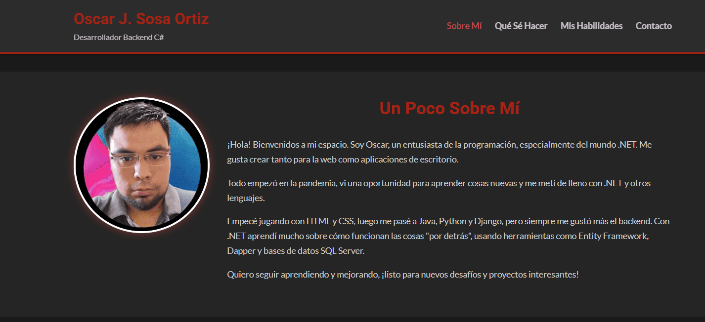

# Portfolio Personal  - Oscar J. Sosa Ortiz
# Creada para trabajo practico personal  de Desarrollo de Sistemas Web (Front End) - 2° E
Este proyecto es la **segunda iteración** de mi portfolio personal, desarrollado como parte de la **Práctica Formativa 2** del curso de desarrollo web. Partiendo de la entrega anterior, se han aplicado mejoras significativas utilizando CSS avanzado para lograr un diseño más profesional, moderno y responsivo.

## 🚀 Demo en Vivo

Puedes acceder y probar la versión desplegada de este portfolio en GitHub Pages a través del siguiente enlace:

[Acceder al Portfolio en Vivo](https://okijulian.github.io/portfolioTecnicaturaOJSO/)

## Mejoras Implementadas ( Práctica Formativa 2):

*   **Mejora de Contenido:**
    *   Se ha mantenido y organizado la descripción personal y de servicios ("Sobre Mí", "Qué Sé Hacer").
*   **Mejora de Estilos:**
    *   **Manejo de tamaños en contenedores:** Uso de unidades relativas (`%`, `vw`, `rem`, `em`) y Flexbox para la estructura principal.
    *   **Manejo de elementos en bloque y en línea:** Correcto uso semántico, evitando ` ` para layout.
    *   **Box Model:** Uso extensivo de márgenes, paddings y bordes para espaciado y diseño.
    *   **Centrado de elementos:** Logrado con Flexbox y `margin: auto`.
    *   **Manejo de fuentes:** Se utiliza Google Fonts (`Roboto`, `Lato`) y tamaños de fuente relativos (`rem`) para escalabilidad.
    *   **Uso de iconos:** Font Awesome integrado en diversas secciones y botones.
    *   **Manejo de enlaces con pseudoclases:** Estilos para `:link`, `:visited`, `:hover`, `:active`.
    *   **Lista para el `nav`:** Menú de navegación horizontal implementado con `ul` y Flexbox, con `list-style-type: none`.
    *   **Estilado de "tabla" (listas):** Se aplica `tr:nth-child(even/odd)` (simulado con `li:nth-child` para las listas de habilidades) para alternar fondos.
    *   **Uso de `z-index`:** Aplicado en la cabecera fija (`position: sticky`).
    *   **Uso de combinadores CSS:** Utilizados selectores descendientes (`div p {}`) y directos (`div > p {}`).
    *   **Manejo de opacidad:** Aplicado en efectos `hover` de enlaces.
*   **Responsividad:**
    *   La página es completamente responsiva y se adapta a 4 tamaños de pantalla principales:
        *   Tablet horizontal (`max-width: 1080px`)
        *   Tablet vertical (`max-width: 768px`)
        *   Móvil 1 (`max-width: 480px`)
        *   Móvil 2 (`max-width: 375px`)
*   **Recordatorios y Buenas Prácticas:**
    *   Estructura de proyecto organizada (`index.html`, `css/styles.css`, `img/`).
    *   Código limpio, comentado e indentado.
    *   CSS separado en bloques lógicos.
    *   Este `README.md` actualizado.

## Puntos de Mejora  de mi primer entrega:

*   **Centrar contenido correctamente:** Logrado con Flexbox y `margin: auto`.
*   **Página responsiva:** Implementado.
*   **Tablas (tarjetas de habilidad) una al lado de la otra:** Logrado con Flexbox, y se apilan en pantallas pequeñas.
*   **Uso de `div` y etiquetas para reorganizar:** Se ha optimizado el uso de `div`s como contenedores Flex y clases para un mejor control.
*   **Foto al lado del nombre/descripción:** La foto ahora está al lado del texto en la sección "Sobre Mí" en pantallas grandes (y se apila en móviles).

## Paleta de Colores:

Se ha optado por un tema oscuro para reducir la fatiga visual y dar un aspecto moderno:
*   **Fondo Principal:** Negro/Gris muy oscuro (`#1a1a1a`, `#252525`, `#2c2c2c`)
*   **Texto Principal:** Gris claro (`#e0e0e0`, `#cccccc`)
*   **Acentos (Títulos, Enlaces, Iconos):** Rojo (`#e74c3c`, `#c0392b`)

---

 

